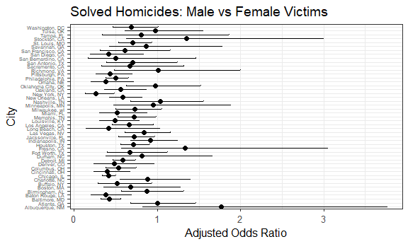
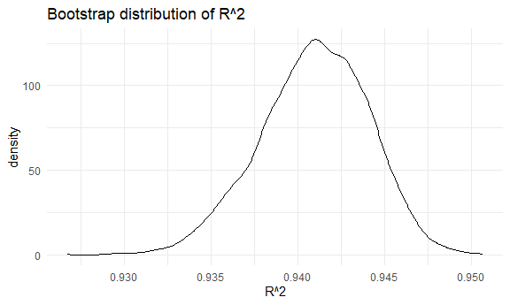
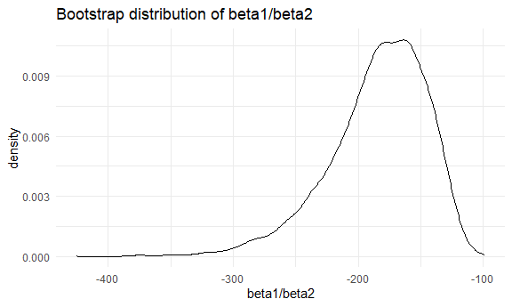
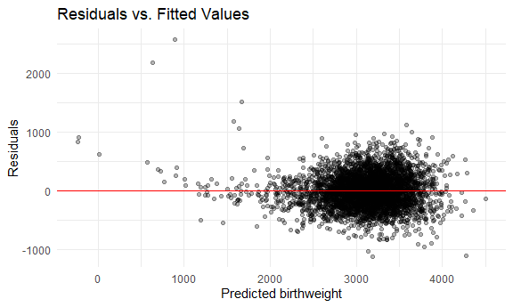
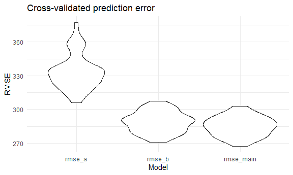

Homework 6
================
Eman Ibrahim

## Problem 1

Loading the homicide dataset then cleaning it

``` r
homicides = 
  read_csv("https://raw.githubusercontent.com/washingtonpost/data-homicides/master/homicide-data.csv")
```

    ## Rows: 52179 Columns: 12
    ## ── Column specification ────────────────────────────────────────────────────────
    ## Delimiter: ","
    ## chr (9): uid, victim_last, victim_first, victim_race, victim_age, victim_sex...
    ## dbl (3): reported_date, lat, lon
    ## 
    ## ℹ Use `spec()` to retrieve the full column specification for this data.
    ## ℹ Specify the column types or set `show_col_types = FALSE` to quiet this message.

``` r
clean_df =
  homicides |>
  mutate(
    city_state = str_c(city, ", ", state),        
    solved = if_else(disposition == "Closed by arrest", 1, 0),
    victim_age = as.numeric(victim_age)
  ) |>
  filter(
    !(city_state %in% c("Dallas, TX", "Phoenix, AZ", "Kansas City, MO", "Tulsa, AL")),
    victim_race %in% c("White","Black")
  )
```

    ## Warning: There was 1 warning in `mutate()`.
    ## ℹ In argument: `victim_age = as.numeric(victim_age)`.
    ## Caused by warning:
    ## ! NAs introduced by coercion

Baltimore only logistic regression:

``` r
baltimore_df =
  clean_df |>
  filter(city_state == "Baltimore, MD")

baltimore_model =
  glm(
    solved ~ victim_age + victim_sex + victim_race,
    data = baltimore_df,
    family= binomial()
  )
```

Let’s get the adjusted OR and 95% CI for male vs female:

``` r
baltimore_results=
  baltimore_model |> 
  tidy(conf.int = TRUE, exponentiate=TRUE)

baltimore_results |> 
  filter(term == "victim_sexMale") |> 
  select(term, estimate, conf.low, conf.high)
```

    ## # A tibble: 1 × 4
    ##   term           estimate conf.low conf.high
    ##   <chr>             <dbl>    <dbl>     <dbl>
    ## 1 victim_sexMale    0.426    0.324     0.558

glm for each city, OR and 95% CI:

``` r
city_models =
  clean_df |>
  group_by(city_state) |>
  nest() |>
  mutate(
    model=map(data,
      ~ glm(
          solved ~ victim_age + victim_sex + victim_race,
          data= .x,
          family = binomial()
        )
    ),
    results= map(model,
      ~ tidy(.x, conf.int = TRUE, exponentiate= TRUE)
    )
  )
```

    ## Warning: There were 43 warnings in `mutate()`.
    ## The first warning was:
    ## ℹ In argument: `results = map(model, ~tidy(.x, conf.int = TRUE, exponentiate =
    ##   TRUE))`.
    ## ℹ In group 1: `city_state = "Albuquerque, NM"`.
    ## Caused by warning:
    ## ! glm.fit: fitted probabilities numerically 0 or 1 occurred
    ## ℹ Run `dplyr::last_dplyr_warnings()` to see the 42 remaining warnings.

to get male vs female in each city:

``` r
city_or_df=
  city_models |> 
  unnest(results) |> 
  filter(term=="victim_sexMale") |> 
  select(city_state, estimate, conf.low, conf.high)
```

Plotting OR and CI by city:

``` r
city_or_df |>
  mutate(city_state= fct_reorder(city_state,estimate)) |>   
  ggplot(aes(x =estimate, y = city_state)) +
  geom_point(size = 2) +
  geom_errorbarh(aes(xmin = conf.low, xmax = conf.high), height = 0.2) +
  labs(
    title ="Solved Homicides: Male vs Female Victims",
    x = "Adjusted Odds Ratio",
    y = "City"
  ) +
  theme_bw(base_size = 12) +
  theme(
    axis.text.y =element_text(size = 5)
  )
```



The odds ratio varies significantly across the cities. I’d say in most
cities, the adjusted OR is below 1, which means homicides with male
victims are less likely to be solved compared to ones with female
victims after adjusting for age and race. Some cities have adjusted ORs
of 1 or higher, but they have a wide confidence intervals, so this could
mean that they may have has a smaller sample size or even uncertainity.
Generally, the pattern we see is that male victim homicides are solved
less frequently.

## Problem 2

load the weather data

``` r
data("weather_df")

weather_lm=
  lm(tmax~tmin+prcp, data=weather_df)
```

bootstrap function:

``` r
bootstrap_func = function(df){
  bootstrap_sample= sample_frac(df, replace = TRUE)
  mod= lm(tmax~tmin + prcp, data = bootstrap_sample)
  r2 = glance(mod)$r.squared
 
  coefs = tidy(mod)
  beta1= coefs$estimate[coefs$term == "tmin"]
  beta2= coefs$estimate[coefs$term == "prcp"]
  tibble(
    r2 = r2,
    beta_ratio = beta1/beta2
  )
}
```

Let’s run 5000 bootstrap samples

``` r
set.seed(1)

bootstrap_results = 
  map_dfr(1:5000, ~bootstrap_func(weather_df))
```

Plotting distribution: r^2:

``` r
bootstrap_results |> 
  ggplot(aes(x=r2))+
  geom_density()+
  labs(
    title= "Bootstrap distribution of R^2",
    x = "R^2"
  )
```



- the bootstrap distribution of this r^2 is narrower and centered around
  0.94.This tells us that the regression model almost always explains
  most of the variation in tmax, no matter which bootstrap sample we
  use.

β1/β2:

``` r
bootstrap_results |> 
  ggplot(aes(x=beta_ratio))+
  geom_density()+
  labs(
    title= "Bootstrap distribution of beta1/beta2",
    x = "beta1/beta2"
  )
```



- The β1/β2 values are more spread out. The ratios are negative, which
  is what’s expected since tmin has a positive effect on tmax (tmin
  increases tmax) while prcp has a small negative effect( prcp slightly
  decreases tmax). There’s also more uncertanity in this ratio.

95% bootstrap Confidence intervals For R^2:

``` r
bootstrap_results |> 
  summarize(
    ci_low = quantile(r2, 0.025),
    ci_high= quantile(r2, 0.975)
  )
```

    ## # A tibble: 1 × 2
    ##   ci_low ci_high
    ##    <dbl>   <dbl>
    ## 1  0.934   0.947

For β1/β2:

``` r
bootstrap_results |> 
  summarize(
     ci_low = quantile(beta_ratio, 0.025),
    ci_high= quantile(beta_ratio, 0.975)
  )
```

    ## # A tibble: 1 × 2
    ##   ci_low ci_high
    ##    <dbl>   <dbl>
    ## 1  -280.   -126.

- Using 5000 bootstrap samples, the 95% CI for the r^2 is very tight, so
  the model is very stable. The β1/β2 interval is wider, meaning less
  certainity about the exact value of the ratio.

## Problem 3

load and clean the data:

``` r
bw_df=
  read_csv("birthweight.csv") |> 
  janitor::clean_names() |> 
  mutate(
    babysex= factor(babysex, levels=c(1,2), labels=c("male", "female")),
    malform = factor(malform, levels = c(0,1), labels= c("absent", "present")),
    frace = factor(frace),
    mrace = factor(mrace),
    parity = as.numeric(parity),
    pnumlbw = as.numeric(pnumlbw),
    pnumsga= as.numeric(pnumsga),
    smoken = as.numeric(smoken)
  ) |> 
  drop_na()
```

    ## Rows: 4342 Columns: 20
    ## ── Column specification ────────────────────────────────────────────────────────
    ## Delimiter: ","
    ## dbl (20): babysex, bhead, blength, bwt, delwt, fincome, frace, gaweeks, malf...
    ## 
    ## ℹ Use `spec()` to retrieve the full column specification for this data.
    ## ℹ Specify the column types or set `show_col_types = FALSE` to quiet this message.

Let’s predict birthweight using some of the variables such as
gastational weeks, length at birth, head circumference, mother’s age,
and any effect of smoking.

``` r
main_model=
  lm(
    bwt~gaweeks + blength + bhead + momage + smoken, data = bw_df
  )
```

- There reason why i chose these variables is bevause they’re
  biologically related to birthweight. POstmature babies, babies who are
  born longer, and those with a larger head size usually weigh more.
  Maternal age and smoking may affect fetal growth.

Let’s plot to check the model fit:

``` r
bw_df |> 
  modelr::add_predictions(main_model) |>
  modelr::add_residuals(main_model) |> 
  ggplot(aes(x=pred, y=resid))+
  geom_point(alpha=0.3)+
  geom_hline(yintercept = 0, color = "red")+
  labs(
    title = "Residuals vs. Fitted Values",
    x = "Predicted birthweight",
    y = "Residuals"
  )
```



- The residuals are mostly centered around zero and don’t have a strong
  pattern. This meands the model fits well. But the spread of residuals
  slightly increases for larger predicted birthweight. this could mean
  that the model may not capture all sources of variation. Overall, this
  plot suggests that the model is reasonable.

Let’s fit the two comparison models

Model A: Length + gestational age (main effects only):

``` r
model_a=
  lm(bwt~ blength +gaweeks, data = bw_df)
```

Model B: Head cirumferece + length +sex + all interactions (including 3
way interaction)

``` r
model_b =
  lm(bwt~ bhead*blength*babysex, data=bw_df)
```

Let’s compare the models using cross-validated prediction error:

``` r
set.seed(1)

cv_df=
  crossv_mc(bw_df, 50) |> 
  mutate(
    train= map(train, as_tibble),
    test= map(test, as_tibble)
  ) |> 
  mutate(
    main_mod= map(train, ~lm(bwt ~ gaweeks + blength + bhead + momage + smoken, data = .)),
    mod_a= map(train, ~lm(bwt ~ blength + gaweeks, data = .)),
    mod_b= map(train, ~lm(bwt ~ bhead * blength * babysex, data = .))
  ) |> 
  mutate(
    rmse_main= map2_dbl(main_mod, test, modelr::rmse),
    rmse_a= map2_dbl(mod_a, test, modelr::rmse),
    rmse_b= map2_dbl(mod_b, test, modelr::rmse)
  )
```

let’s plot the RMSE comparison:

``` r
cv_df |> 
  select(starts_with("rmse")) |> 
  pivot_longer(everything(),
               names_to="model",
               values_to = "rmse") |> 
  ggplot(aes(x=model, y=rmse))+
  geom_violin()+
  labs(
    title = "Cross-validated prediction error",
    x = "Model",
    y = "RMSE"
  )
```



- Baed on 50 fold cross-validated RMSE, the main model I proposed
  performed the best overall. Model A using length and gestational age
  only had a low performance, suggesting that the two variables don’t
  fully really explain birthweight. Model B which used all interactions
  did way better than Model A, but not as good as my main model, likely
  because the interaction does generalize as well and also it was
  complex. So overall, I’d say the main model has a good biological
  reasoning and prediction accuracy.
